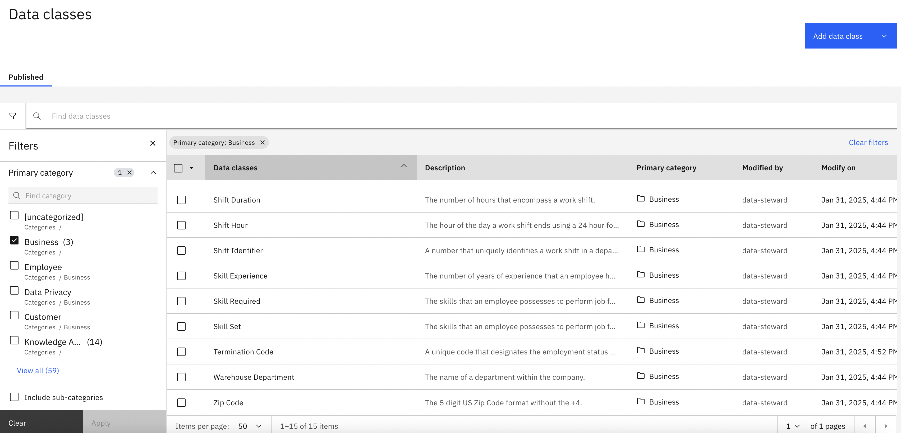
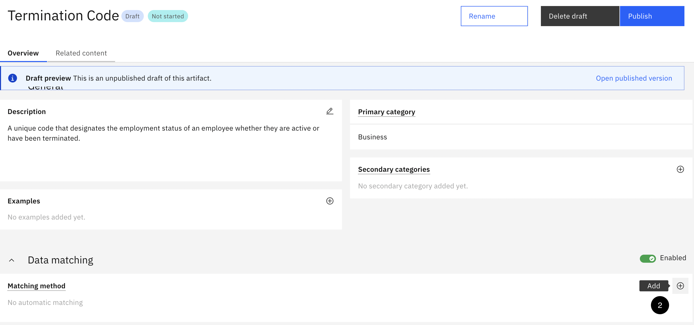
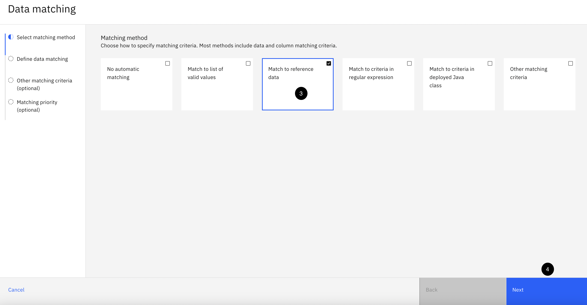
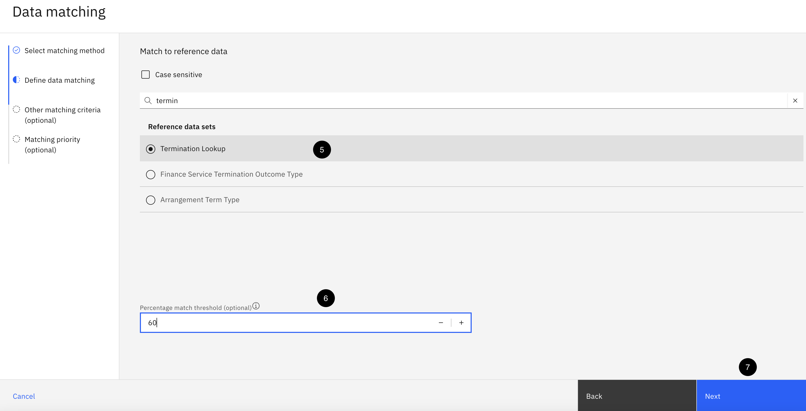
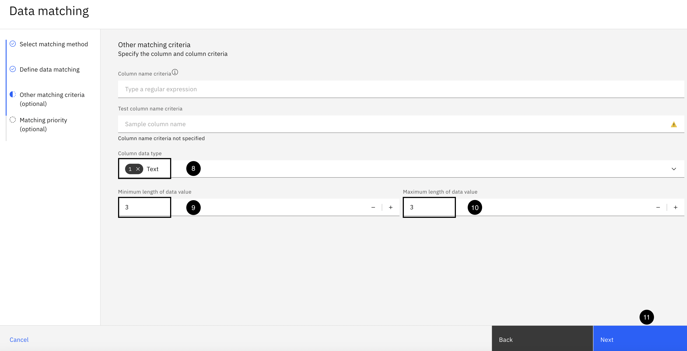
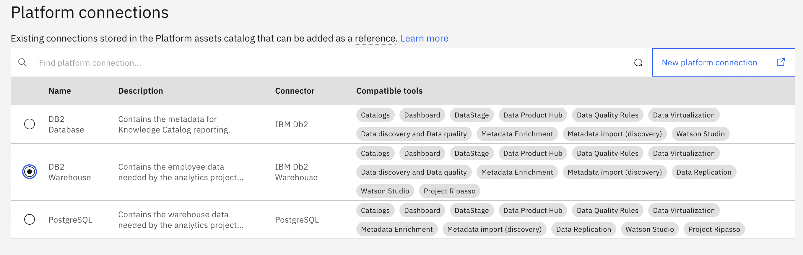

# Follow the steps described below

Table of contents:
1. [Personas and their roles](https://github.com/Client-Engineering-Indonesia/Data-Intelligent-Incubation-Feb-2025/blob/main/IBM%20Knowledge%20Catalog/Hands-on%20Lab%20-%20IBM%20Knowledge%20Catalog.md#section1)
2. [Connect your data sources](https://github.com/Client-Engineering-Indonesia/Data-Intelligent-Incubation-Feb-2025/blob/main/IBM%20Knowledge%20Catalog/Hands-on%20Lab%20-%20IBM%20Knowledge%20Catalog.md#section2)
3. [Define Business Vocabulary](https://github.com/Client-Engineering-Indonesia/Data-Intelligent-Incubation-Feb-2025/blob/main/IBM%20Knowledge%20Catalog/Hands-on%20Lab%20-%20IBM%20Knowledge%20Catalog.md#section3)
4. [Curate and enrich data assets](https://github.com/Client-Engineering-Indonesia/Data-Intelligent-Incubation-Feb-2025/blob/main/IBM%20Knowledge%20Catalog/Hands-on%20Lab%20-%20IBM%20Knowledge%20Catalog.md#section4)
5. [Catalog Governed Data](https://github.com/Client-Engineering-Indonesia/Data-Intelligent-Incubation-Feb-2025/blob/main/IBM%20Knowledge%20Catalog/Hands-on%20Lab%20-%20IBM%20Knowledge%20Catalog.md#section5)
6. [Define Policies and Rules](https://github.com/Client-Engineering-Indonesia/Data-Intelligent-Incubation-Feb-2025/blob/main/IBM%20Knowledge%20Catalog/Hands-on%20Lab%20-%20IBM%20Knowledge%20Catalog.md#section6) 
7. [Manage Data Quality](https://github.com/Client-Engineering-Indonesia/Data-Intelligent-Incubation-Feb-2025/blob/main/IBM%20Knowledge%20Catalog/Hands-on%20Lab%20-%20IBM%20Knowledge%20Catalog.md#section7) 

<h1 id="section1">1. Personas and their roles</h1>

| Role | Responsibilities |
| --   |       ---        |
| Data Steward  | 1. Define and publish a complete and meaningful set of business vocabulary **governance artifacts**.   2. Create the **governance rules** that were required by the governance policy that protects sensitive information.  3. Create the **data protection rules** to protect personal and sensitive information based on the approved governance policies and rules.  4. Discover and **import the data assets** that were needed using the Metadata Import tool.   5. Curate the data assets using the **Metadata enrichment** tool to profile, access data quality, and assign business terms and data classes.  6. **Publish the connections and data assets** to a governed catalog.  7. **Augment the cataloged assets** with additional metadata: Tags, Classifications, Related Assets, and Reviews.  |
| Privacy Steward | **Review and approve** the governance policies and rules.|
| Quality Analyst | 1. **Assess** data quality issues and **create a data quality definition** and data quality rules.  2. **Create a Data Quality SLA remediation rule** to monitor data quality issues that invokes the data quality SLA remediation workflow.|
| Business User (Data Scientist) | **Find the data they need** and review the catalog assets and metadata. |

Other than the roles mentioned above, there is another role responsible for managing system configuration, which is the Administrator. In this use case, this role is responsible for:
1. Defining the roles --such as Data Steward, Privacy Steward, Quality Analyst, and Business User--, setting permissions for each role, and assigning roles to users;
2. Defining the data sources that contain the relevant data needed by the project team.

<h1 id="section2">2. Connect to data sources</h1>
The very first step in your journey to establishing Data Intelligence in your organization is to identify all data sources within your company and establish connections to those systems. This step is ideally performed by the Administrator or Senior Data Stewards. Some large organizations grant each data owner (producer) access to their Knowledge Catalog, allowing them to connect their data sources independently.

Before the data governance lifecycle processes can begin, data stewards and data consumers need access to data. As a best practice, identifying and providing access to data sources needs to happen before data stewardship can begin so that the data is accessible to the data steward to begin discovering relevant data, analyzing data content and quality, and enforcing data privacy policies in order to provide timely access to high quality, governed data to the data consumers who will use it for analytics and AI.

Goals:
- [ ] Check platform connections provided by Administrator

Steps
1. Login as Data Steward using the assigned username and password to the Knowledge Catalog platform.
2. Select Data > Connectivity from the menu

3. You will see 3 available connections on platform level that have been created by the Administator.

<h1 id="section3">3. Define Business Vocabulary</h1>

This section creates all the governance artifacts needed to establish a trusted, business ready, governance foundation. It uses a set of CSV files to import and create the artifacts in the upcoming steps so make sure the governance artifacts zip file has been downloaded and unzipped. Download here: [Data Cataloging and Governance](https://github.com/CloudPak-Outcomes/Outcomes-Projects/blob/main/Knowledge-Catalog-L4-PoX-Lab/Knowledge-Catalog-L4-PoX-Lab.zip)

It is essential to establish the business vocabulary first before any data curation, enrichment and cataloging of data assets takes place. This is because governance artifacts, like data classes and business terms, can be automatically assigned to data assets during metadata enrichment and cataloging. If not, all of those tasks would have to be done manually, which defeats taking advantage of the automated and built-in data governance capabilities of Knowledge Catalog.

#### 1. Create custom properties
Custom properties and relationships need to be defined before any data governance artifacts are defined because they will be attributes of those governance artifacts and need to be established before the artifacts are imported and created. 

Goal: 
- [ ] Create a custom property, called Department, that will be added to all business terms. 

Steps
1. Select the Navigation menu (the 4 stacked horizontal lines in the upper left corner).
2. Select Administration > Governance and catalogs from the menu.

3. Select the `Asset and artifact definitions` tile.
4. Select the `Custom properties` definition from the left side menu.
5. Click the `Import from file` button.

6. Click the `Drag and drop file here or upload` link.
7. Select the `governance-custom-attributes.json` file from your download location.
8. Click the `Open` button.

9. Click the `Import` button.
10. A message box will appear with a notification that 1/1 custom attributed was imported successfully.

#### 2. Create categories
Categories act as folders or directories to organize governance artifacts and provide access controls to authorize who can author and manage those artifacts. Categories provide the logical structure for all governance artifacts, except data protection rules. You group governance artifacts in categories to make them easy to find and manage, and to control their visibility. Categories can be organized in a hierarchy based on their meaning and relationships to one another. A category can have subcategories, but a subcategory can have only one direct parent category.

In this section, 3 categories will be imported and created (one parent category and two sub-categories) that will provide the logical structure for the governance artifacts that are defined in this lab.

Goals:
- [ ] Create categories by importing the CSV file containing the list of categories.

Steps
1. Select the Navigation menu (the 4 stacked horizontal lines in the upper left corner).
2. Select `Governance` > `Categories` from the menu.

3. Using the `Add category` dropdown, select `Import from file`.

4. Click the `Drag and drop file here or upload` link.
5. Select the governance-categories.csv file from your download location.
6. Click the `Open` button.

7. Click the `Next` button.
8. Select the `Replace all values merge` option. NB: If you 
9. Click the `Next` button.

10. Select the `Close` button.
11. Refresh the page. You should see the `[uncategorized]` and `Locations` system categories and the 3 new categories that were imported and created with a parent category named: Business and two sub-categories underneath it named: Employee and Data Privacy.

#### 3. Create classifications 
Classifications are labels that can be attached to describe data assets. The default classifications available on the platform are Personal Information, Personally Identifiable Information, and Sensitive Personal Information. Additional classifications include, for example, Confidential, Internal, and Public.

Goals:
- [ ] Import classifications from csv file

Steps:
1. Select the Navigation menu (the 4 stacked horizontal lines in the upper left corner). Select `Governance` > `Classifications` from the menu. Using the Add classification dropdown, select `Import from file`.

2. Click the `Drag and drop file here or upload` link.
3. Select the `governance-classifications.csv` file from your download location.
4. Click the `Open` button.

5. Click the `Next` button.
6. Select the `Replace only empty values` merge option.
7. Click the `Next` button.
From this point forward, all governance artifacts have to be published. Categories and Data Protection Rules do not need to be published but all other governance artifacts you create or update will be in draft mode until you publish them.
8. Click the `Go to task` button.

9. Click the `Publish` button.

10. Click the `Publish` button again without entering a comment.

11. Select the Navigation menu (the 4 stacked horizontal lines in the upper left corner). 
12. Select the `Governance` > `Classifications` menu.
13. Select the `Confidential` classification. The first classification in the list.

Notice: that the classification has a tag of Employee and that it was also assigned to the `Business` >> `Employee` sub-category as a secondary category. All of the classifications will have the same change applied. If time permits, and you are curious, select the other 3 classifications to see the same changes have been applied.

#### 4. Create reference data
Reference data sets provide logical groupings of code values (reference data values), such as department and gender codes. These codes are sets of allowed values that are associated with data fields and can be assigned to data classes. Which is why they need to be created before data classes are created.

Reference data sets are created so that enterprise standards can be accessed centrally by users or by consuming applications through APIs. Reference data sets can also be used to provide the matching pattern for data classes, allowing data fields to be automatically classified through data profiling and discovery. These data classes can then be used in data quality analysis to evaluate the quality and consistency of the values in data columns. Which is why you create data classes before you create reference data.

Goals:
- [ ] Add reference dataset of Termination Code from CSV file.

Steps:
1. Select the Navigation menu (the 4 stacked horizontal lines in the upper left corner).
2. Select the `Governance` > `Reference data` menu.

3. Using the `Add reference data set` dropdown, select `New reference data set`.

4. Click the `Drag and drop file here or upload` link.

5. Select the `governance-termination.csv` file from the download location.

6. Click the `Open` button.
7. Click the Copy button below and paste the value into the Name field:
`Termination Lookup`
8. Click the Copy button below and paste the value into the Description field:
`Valid codes and values for employee termination codes.`
9. Click the `Select` button to select a primary category.

10. Select the `Business` parent category to open it and see the secondary categories. Do not select the radio button.
11. Select the radio button on the `Employee` sub-category.
12. Click the `Add` button.

13. Click the `Next` button.

14. Make sure the `First row as column header` option is set to `On`.
15. Using the `Column` dropdown, select the `TERMINATION_CODE` column from the list.
16. Using the `Target column` dropdown, select `Code` from the list.

17. Using the `Column` dropdown, select the `TERMINATION_VALUE` column from the list.
18. Using the `Select column` Target columns dropdown, select `Value` from the list.
19. Click the `Next` button.

20. Click the `Create` button.
21. Click the `Publish` button.

22. Click the `Publish` button again without entering a comment.
23. Click the `Reference data` breadcrumb to get back to the reference data home page.

#### 5. Create data classes
In the context of a Knowledge Catalog, Data Classes describe the format of the content in table columns. They provide a description of the data, examples, and the categories to which they belong. They also define data matching capabilities, including criteria, matching methods, and regular expressions. Lastly, they determine relationships with other governance artifacts.

Goals:
- [ ] Import Data Classes from CSV file
- [ ] Configure data matching to Termination Code reference dataset

Steps:
1. Select the Navigation menu (the 4 stacked horizontal lines in the upper left corner).
2. Select the `Governance` > `Data classes` menu.

3. Using the `Add data class` dropdown, select `Import from file`.
4. Click the `Drag and drop file here or upload` link.
5. Select the `governance-data-classes.csv` file from your download location.

6. Click `Open`.
7. Click the `Next` button.
8. Select `Replace all values` merge option.
9. Click the `Next` button. The import should complete successfully with 15 new data classes imported.
10. Click the `Go to task` button. You should see 15 new data classes to publish.
11. Click the `Publish` button.
12. Click the `Publish` button again without entering a comment.

Before proceeding, the Termination Code data class needs to be updated to use the Termination Lookup reference data set that was just created in the previous step as the matching criteria for the data class. The matching criteria definition for this data class could not be set in the CSV file that was used to import the data classes because the definition uses the reference data set's unique guid as the name for the reference data set which is different in every environment. This also provides an opportunity to learn how to set matching criteria for a data class to ensure that Knowledge Catalog will use it during the Metadata enrichment process.

1. Select the `Termination Code` data class from the list.

2. In the `Data matching` section, click the `Add button` to add a matching method. 

3. Select `Match to reference data` as the matching method.
4. Click the Next button.

5. Select `Termination Lookup` as the reference data set.
6. Change the `Percentage match threshold` option to ==60==.
7. Click the `Next` button.

8. Using the `Column data type` dropdown, select `Text`.
9. Enter 3 for the Minimum length of data value field.
10. Enter 3 for the Maximum length of data value field.
11. Click the `Next` button.

12. Set the `Data class priority` to 12.
13. Click the `Save` button.
14. Click the `Publish` button.
15. Click the `Publish` button again without entering a comment.

#### 6. Create business terms
Business terms have references to data classes and classifications, and can be referenced in data governance and data protection rules, so they need to be defined after data classes and classifications but before data governance or data protection rules that reference them. Business terms can also be related to other business terms so they must be imported in a specific order. The business terms in the CSV import file you will use are in the correct order to establish these relationships.

You will import and create 150 business terms. Using the import process for such a large volume of governance artifacts is a prime example of the type of productivity automation that is provided by Knowledge Catalog. This is a huge time saver that runs in minutes. Doing this manually would take a data steward hours or days.

Goal:
- [ ] Import business terms from a CSV file

Steps:
1. Select the `Navigation` menu (the 4 stacked horizontal lines in the upper left corner).
2. Select the `Governance` > `Business` terms menu.

3. Using the `Add business term` dropdown, select `Import from file`.
4. Click the `Drag and drop file here or upload` link.
5. Select the `governance-business-terms.csv` file from the download location.
6. Click the `Open` button.
7. Click the `Next` button.
8. Select `Replace all values` as the merge option.
9. Click the `Next` button. The import should complete successfully with 29 new business terms imported.
10. Click the `Go to task` button. You should see 29 new business terms to publish.
11. Click the `Publish` button.
12. Click the `Publish` button again without entering a comment.

<h1 id="section4">4. Curate and enrich data assets</h1>
Now that there is a well defined business glossary established with a complete set of published governance artifacts, the data curation process can begin. Data curation is the process of discovering and adding data assets to a project or a catalog, enriching them by assigning classifications, data classes, and business terms, and analyzing and improving the quality of the data.

### 1. Create the Enrichment Project 
In this section, the project is created that will be used to create and execute the automated Metadata import and enrichment processes to discover and curate the data assets needed by the analytics project team before they are published to the governed Business catalog.

Goals: 
- [ ] Create a project in Data Studio
- [ ] Manage access control
- [ ] Adjust project settings

Steps: 
1. Select the `Navigation` menu (the 4 stacked horizontal lines in the upper left corner).
2. Select the `Projects` > `All projects` menu.

3. Click the `New project+` button.
4. Insert the text below into the `Name` field:
`Business Catalog Enrichment`
5. Add `Description`: This project is used to import and enrich the metadata for the data assets that will be published to the Business catalog that will be accessible to the analytics project team for analytics and AI tasks.

6. Click the `Create` button.

#### Manage Access Control 
In order to manage data quality for the project, the Quality Analyst needs be added to the project with Edit authority.
1. Click the `Manage` tab.

2. Select the `Access control` project menu.
3. Using the `Add collaborators` dropdown, select `Add users`.

4. Enter the word 'quality' in the search area.
5. Select the checkbox next to the Quality Analyst user.
6. Using the Role dropdown, select `Admin` for the Quality Analyst user.
7. Click the `Add` button.

#### Adjust Project Settings
The project **Metadata enrichment settings** are distinct to each project and apply to all metadata enrichment assets created in a project. They are available as global project settings that can be set prior to the creation and execution of metadata enrichment jobs. As a best practice, these settings should be reviewed and adjusted in advance of creating and running metadata enrichment jobs to ensure they will produce the most accurate results.
1. Select the `Metadata enrichment` settings project menu.
2. Scroll down until the `Term assignment` settings are at the top of the page.
3. In the Term assignment methods to use area, clear the `Machine learning` and  `Data-class-based assignments` check boxes. The only method that will be used and that wil remain selected is `Name matching`.
4. In the Select assets used for training built in model and adjustment area, select the `From Project` radio button.
5. Click the `Assets` tab.

### 3. Import Platform Connections
The Administrator has connected the platform to DB2 and PostgreSQL databases. Your task as a data steward is to import the connections into the project.

Goal:
- [ ] Import connections to DB2 and PostgreSQl

Steps:
1. Click the `Assets` tab.
2. Click the `New asset +` button.

3. Select the `Connect to a data source` task. Take some time to review the comprehensive list of data sources that we can connect to. Do you find data sources that are used in your organization?

4. Enter the word `post` into the search area.
5. Select the `PostgreSQL` data source type from the left side panel.
6. Click the `Select a platform connection` tab.
7. Select the `PostgreSQL` platform connection radio button.
8. Click the `Next` button.

9. Click the `Create` button.
10. Redo the steps to add `DB2 Warehouse` data sources

### 4. Import the Data Assets
This section uses the automated Metadata import tool to quickly and easily connect to data source connections to discover and add the data assets that are relevant to the enrichment project.

Goals:
- [ ] Import Employee table from DB2 Warehouse
- [ ] Import some tables from PostgreSQL

In this step, you will create the Metadata Import to import the Employee data asset from the Data Warehouse connection into the project.
1. Click the `New asset +` button.

2. Select the `Prepare data` goal from the tools menu on the left.
3. Select the `Import metadata for data assets` tool.

4. Select the `Discover` goal.
5. Click the `Next` button.

6. Fill `Name` field: `Db2 Warehouse Import`
7. Fill `Description` field: `Discover and import the Employee data asset and associated metadata that were requested by the analytics project team that reside in the Db2 Warehouse data source`.
8. Click the `Next` button.
9. Select `This project (Business Catalog Enrichment)` as the target (it should be selected by default).
10. Click the `Next` button.

11. Click the `Select connection` button.
12. Select the `Db2 Warehouse` connection from the Connections list on the left.
13. Select the `Arrow` on the `EMPLOYEE` schema. `Do not select the checkbox` next to the `EMPLOYEE` schema. Doing so will select all tables in the schema.
14. Select the checkbox for the `EMPLOYEE` table from the list.
15. Click the `Select` button.

16. Click the `Next` button. 
17. Take the default Job name and leave the Run definition to Run after job creation. Click the `Next` button.
18. Take the default `Advanced options` that are selected for `Update on reimport`. Click the `Next` button.
19. Click the `Create` button.
 The import process should run quickly. In a few seconds, you should begin seeing the import process adding the data assets you selected to the Imported assets list. You can click on the Refresh button at the top of the page to update the results.
20. When the import is complete, you should see a message at the top of the page: `Metadata import complete. 1 assets were imported successfully`. The data asset will appear in the Imported assets list and is now added to the project. Select the `Business Catalog Enrichment` project breadcrumb at the top of the page to get back to the project home page.

In this step, you will create the Metadata Import to import the Warehouse data assets from the PostgreSQL connection into the project. 
1. Click the `New asset +` button.
2. Select the `Prepare data` goal from the tools menu on the left.
3. Select the `Import metadata for data assets` tool.
4. Select the `Discover` goal.
5. Click the `Next` button.
6. Fill `Name`: `PostgreSQL Import`
7. Fill `Description`: `Discover and import the Warehouse data assets and associated metadata that were requested by the analytics project team that reside in the PostgreSQL data source.`
8. Click the `Next` button.
9. Select `This project (Business Catalog Enrichment)` as the target (It should be selected by default).
10. Click the `Next` button.
11. Click the `Select connection` button.
12. Select the `PostgreSQL` connection from the Connections list on the left.
13. Enter the word 'warehouse' in the schema search area.
14. Select the Arrow on the WAREHOUSE schema. Do not select the checkbox next to the WAREHOUSE schema. Doing so will select all tables in the schema. This method shows you what tables are in the schema so you can see exactly what will be imported.
15. Select the checkbox next to the `WAREHOUSE_SHIFTS`, `WAREHOUSE_STAFF`, and `WAREHOUSE_STAFFING` tables.
16. Click the `Select` button.

17. Click the `Next` button.
18. Take the default Job name and leave the Run definition to `Run after job creation`. Click the `Next` button.
19. Take the default `Advanced options` that are selected for `Update on reimport`. Click the `Next` button.
20. Click the `Create` button.
When the import is complete, you should see a message at the top of the page: `Metadata import complete. 3 assets were imported successfully.` The data assets will appear in the Imported assets list and are now added to the project.

### 5. Enrich the Data Assets
This section uses the automated Metadata enrichment tool provided by Knowledge Catalog to enrich the data assets that were discovered and imported during the Metadata import processes that was just completed. Metadata imports can be used as input into Metadata enrichment processes to automatically profile the data, analyze and assess data quality, and assign data classifications and business terms by leveraging governance artifacts defined in the business glossary.

Goal:
- [ ] Run metadata enrichment on imported tables.

Steps:
1. Inside the `Project`, click the `New Asset +` button.
2. Select the `Prepare data` goal from the tools menu on the left.
3. Select the `Enrich data assets with metadata` tool.

4. Fill `Name`: `Business Catalog Enrichment`
5. FIll `Description`: `Enrich the metadata for all the data assets that are being published to the Business catalog for the analytics project team.`
6. Click the `Next` button.

7. Click the `Select data from project` button.
8. Select the `Metadata Import` from the Asset types list on the left.
9. Select the high level checkbox in the Metadata Imports section to select all the metadata imports you just completed.
10. Click the `Select` button.

11. Click the `Next` button.
12. Select the checkbox for the `Profile data` Enrichment objective.
13. Select the checkbox for the `Analyze quality` Enrichment objective.
14. Select the checkbox for the `Assign terms` Enrichment objective.
15. Click the `Select categories +` button.

16. Select the checkbox next to the `[uncategorized]` category.
17. Select the checkbox next to the `Business` category.
18. Click the `Select` button.

19. Select the `Basic` sampling method (it should be selected by default).
20. Click the `Next` button.

21. Select `All data assets` for the Data scope of reruns option (it should be selected by default).
22. Click the `Next` button.

23. Take a minute to review the metadata enrichment before creating it. The Data Scope will be analyzing 2 data assets (these are the 2 metadata imports that contain the 4 data assets that were just created) with an enrichment Objective to Profile data, Analyze quality and Assign terms across 5 Categories using the Basic sampling method. Click the `Create` button.

24. Select the `Refresh` button to update the status and monitor the progress. Eventually a message will appear notifying you that the Metadata enrichment completed with a Refresh button.
25. Select the `Refresh` button.
26. Select the X in the top right corner of the `About this metadata enrichment` panel to close it to view the data asset enrichment status.

### 6. Review Enrichment Result
Notice that data classes are not assigned at the asset level and that no business terms were assigned at the asset level. It is more important to have business terms automatically assigned at the column level, especially if business terms are being used to trigger data protection rule actions. Business terms at the data asset level are primarily for informational purposes. 

### 8. Rectify Enrichment Result

<h1 id="section5">5. Catalog Governed Data</h1>

- create catalog
- publish connection
- publish data assets
- augment postgreSQL
- augment Employee Metadata

<h1 id="section6">6. Define Policies and Rules</h1>

- Define workflow for data privacy
- create governance policy
- create governance rules 
- approve as privacy steward
- create date of birth rule
- create email address rule
- Approve as Privacy Steward

<h1 id="section7">7. Manage Data Quality </h1>

- data quality remidiation workflow
- review quality result
- add db2 connection 
- create data quality definition
- create data quality Rule
- create data quality SLA rule
- activate SLA rule monitoring

---
8. Discover Data
- Find the right data
- review featured assets
- review employee data

---
9. About IBM Knowledge Accelerator

