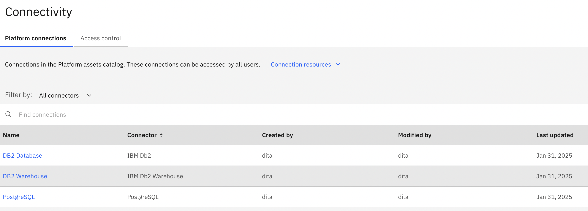
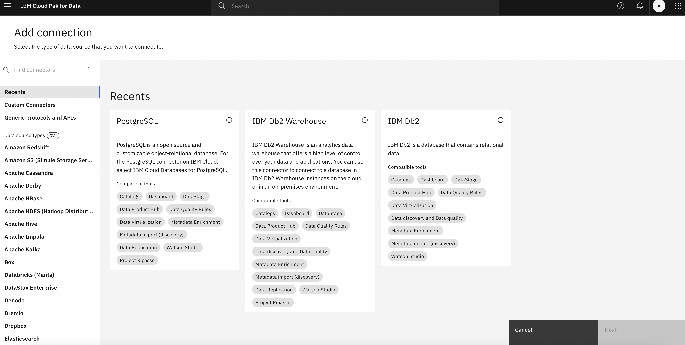

# Follow the steps described below

Table of contents:
1. [Personas and their roles](https://github.com/Client-Engineering-Indonesia/Data-Intelligent-Incubation-Feb-2025/blob/main/IBM%20Knowledge%20Catalog/Hands-on%20Lab%20-%20IBM%20Knowledge%20Catalog.md#section1)
2. [Connect your data sources](https://github.com/Client-Engineering-Indonesia/Data-Intelligent-Incubation-Feb-2025/blob/main/IBM%20Knowledge%20Catalog/Hands-on%20Lab%20-%20IBM%20Knowledge%20Catalog.md#section2)

# 1. Personas and their roles {#section1}
| Role | Responsibilities |
| --   |       ---        |
| Data Steward  | 1. Define and publish a complete and meaningful set of business vocabulary **governance artifacts**.   2. Create the **governance rules** that were required by the governance policy that protects sensitive information.  3. Create the **data protection rules** to protect personal and sensitive information based on the approved governance policies and rules.  4. Discover and **import the data assets** that were needed using the Metadata Import tool.   5. Curate the data assets using the **Metadata enrichment** tool to profile, access data quality, and assign business terms and data classes.  6. **Publish the connections and data assets** to a governed catalog.  7. **Augment the cataloged assets** with additional metadata: Tags, Classifications, Related Assets, and Reviews.  |
| Privacy Steward | **Review and approve** the governance policies and rules.|
| Quality Analyst | 1. **Assess** data quality issues and **create a data quality definition** and data quality rules.  2. **Create a Data Quality SLA remediation rule** to monitor data quality issues that invokes the data quality SLA remediation workflow.|
| Business User (Data Scientist) | **Find the data they need** and review the catalog assets and metadata. |

Other than the roles mentioned above, there is another role responsible for managing system configuration, which is the Administrator. In this use case, this role is responsible for:
1. Defining the roles --such as Data Steward, Privacy Steward, Quality Analyst, and Business User--, setting permissions for each role, and assigning roles to users;
2. Defining the data sources that contain the relevant data needed by the project team.

---
# 2. Connect to data sources {#section2}
The very first step in your journey to establishing Data Intelligence in your organization is to identify all data sources within your company and establish connections to those systems. This step is ideally performed by the Administrator or Senior Data Stewards. Some large organizations grant each data owner (producer) access to their Knowledge Catalog, allowing them to connect their data sources independently.

Before the data governance lifecycle processes can begin, data stewards and data consumers need access to data. As a best practice, identifying and providing access to data sources needs to happen before data stewardship can begin so that the data is accessible to the data steward to begin discovering relevant data, analyzing data content and quality, and enforcing data privacy policies in order to provide timely access to high quality, governed data to the data consumers who will use it for analytics and AI.

Goals:
- [ ] Check platform connections provided by Administrator

##### Steps
1. Login as Data Steward using the assigned username and password. 
2. Select Data > Connectivity from the menu

3. You will see 3 available connections on platform level that have been created by the Administator.

---
# 3. Define Business Vocabulary {#section3}
- create custom properties
- create categories
- create classifications 
- create reference data
- create data classes
- create business terms

---
# 4. Curate and enrich data assets {#section4}
- create project 
- review available connections

- import data assets
- enrich data assets
- review asset enrichment
- review column enrichment
- rectify 

---
5. Catalog Governed Data
- create catalog
- publish connection
- publish data assets
- augment postgreSQL
- augment Employee Metadata

---
6. Define Policies and Rules
- Define workflow for data privacy
- create governance policy
- create governance rules 
- approve as privacy steward
- create date of birth rule
- create email address rule
- Approve as Privacy Steward

---
7. Manage Data Quality 
- data quality remidiation workflow
- review quality result
- add db2 connection 
- create data quality definition
- create data quality Rule
- create data quality SLA rule
- activate SLA rule monitoring

---
8. Discover Data
- Find the right data
- review featured assets
- review employee data

---
9. About IBM Knowledge Accelerator

