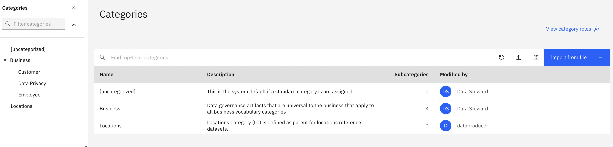

# Follow the steps described below

Table of contents:
1. [Personas and their roles](https://github.com/Client-Engineering-Indonesia/Data-Intelligent-Incubation-Feb-2025/blob/main/IBM%20Knowledge%20Catalog/Hands-on%20Lab%20-%20IBM%20Knowledge%20Catalog.md#section1)
2. [Connect your data sources](https://github.com/Client-Engineering-Indonesia/Data-Intelligent-Incubation-Feb-2025/blob/main/IBM%20Knowledge%20Catalog/Hands-on%20Lab%20-%20IBM%20Knowledge%20Catalog.md#section2)
3. [Define Business Vocabulary](https://github.com/Client-Engineering-Indonesia/Data-Intelligent-Incubation-Feb-2025/blob/main/IBM%20Knowledge%20Catalog/Hands-on%20Lab%20-%20IBM%20Knowledge%20Catalog.md#section3)
4. [Curate and enrich data assets](https://github.com/Client-Engineering-Indonesia/Data-Intelligent-Incubation-Feb-2025/blob/main/IBM%20Knowledge%20Catalog/Hands-on%20Lab%20-%20IBM%20Knowledge%20Catalog.md#section4)
5. [Catalog Governed Data](https://github.com/Client-Engineering-Indonesia/Data-Intelligent-Incubation-Feb-2025/blob/main/IBM%20Knowledge%20Catalog/Hands-on%20Lab%20-%20IBM%20Knowledge%20Catalog.md#section5)

<h1 id="section1">1. Personas and their roles</h1>

| Role | Responsibilities |
| --   |       ---        |
| Data Steward  | 1. Define and publish a complete and meaningful set of business vocabulary **governance artifacts**.   2. Create the **governance rules** that were required by the governance policy that protects sensitive information.  3. Create the **data protection rules** to protect personal and sensitive information based on the approved governance policies and rules.  4. Discover and **import the data assets** that were needed using the Metadata Import tool.   5. Curate the data assets using the **Metadata enrichment** tool to profile, access data quality, and assign business terms and data classes.  6. **Publish the connections and data assets** to a governed catalog.  7. **Augment the cataloged assets** with additional metadata: Tags, Classifications, Related Assets, and Reviews.  |
| Privacy Steward | **Review and approve** the governance policies and rules.|
| Quality Analyst | 1. **Assess** data quality issues and **create a data quality definition** and data quality rules.  2. **Create a Data Quality SLA remediation rule** to monitor data quality issues that invokes the data quality SLA remediation workflow.|
| Business User (Data Scientist) | **Find the data they need** and review the catalog assets and metadata. |

Other than the roles mentioned above, there is another role responsible for managing system configuration, which is the Administrator. In this use case, this role is responsible for:
1. Defining the roles --such as Data Steward, Privacy Steward, Quality Analyst, and Business User--, setting permissions for each role, and assigning roles to users;
2. Defining the data sources that contain the relevant data needed by the project team.

<h1 id="section2">2. Connect to data sources</h1>
The very first step in your journey to establishing Data Intelligence in your organization is to identify all data sources within your company and establish connections to those systems. This step is ideally performed by the Administrator or Senior Data Stewards. Some large organizations grant each data owner (producer) access to their Knowledge Catalog, allowing them to connect their data sources independently.

Before the data governance lifecycle processes can begin, data stewards and data consumers need access to data. As a best practice, identifying and providing access to data sources needs to happen before data stewardship can begin so that the data is accessible to the data steward to begin discovering relevant data, analyzing data content and quality, and enforcing data privacy policies in order to provide timely access to high quality, governed data to the data consumers who will use it for analytics and AI.

Goals:
- [ ] Check platform connections provided by Administrator

Steps
1. Login as Data Steward using the assigned username and password to the Knowledge Catalog platform.
2. Select Data > Connectivity from the menu

3. You will see 3 available connections on platform level that have been created by the Administator.

<h1 id="section3">3. Define Business Vocabulary</h1>

This section creates all the governance artifacts needed to establish a trusted, business ready, governance foundation. It uses a set of CSV files to import and create the artifacts in the upcoming steps so make sure the governance artifacts zip file has been downloaded and unzipped. Download here: [Data Cataloging and Governance](https://github.com/CloudPak-Outcomes/Outcomes-Projects/blob/main/Knowledge-Catalog-L4-PoX-Lab/Knowledge-Catalog-L4-PoX-Lab.zip)

It is essential to establish the business vocabulary first before any data curation, enrichment and cataloging of data assets takes place. This is because governance artifacts, like data classes and business terms, can be automatically assigned to data assets during metadata enrichment and cataloging. If not, all of those tasks would have to be done manually, which defeats taking advantage of the automated and built-in data governance capabilities of Knowledge Catalog.

#### 1. Create custom properties
Custom properties and relationships need to be defined before any data governance artifacts are defined because they will be attributes of those governance artifacts and need to be established before the artifacts are imported and created. 

Goal: 
- [ ] Create a custom property, called Department, that will be added to all business terms. 

Steps
1. Select the Navigation menu (the 4 stacked horizontal lines in the upper left corner).
2. Select Administration > Governance and catalogs from the menu.

3. Select the `Asset and artifact definitions` tile.
4. Select the `Custom properties` definition from the left side menu.
5. Click the `Import from file` button.

6. Click the `Drag and drop file here or upload` link.
7. Select the `governance-custom-attributes.json` file from your download location.
8. Click the `Open` button.

9. Click the `Import` button.
10. A message box will appear with a notification that 1/1 custom attributed was imported successfully.

#### 2. Create categories
Categories act as folders or directories to organize governance artifacts and provide access controls to authorize who can author and manage those artifacts. Categories provide the logical structure for all governance artifacts, except data protection rules. You group governance artifacts in categories to make them easy to find and manage, and to control their visibility. Categories can be organized in a hierarchy based on their meaning and relationships to one another. A category can have subcategories, but a subcategory can have only one direct parent category.

In this section, 3 categories will be imported and created (one parent category and two sub-categories) that will provide the logical structure for the governance artifacts that are defined in this lab.

Goals:
- [ ] Create categories by importing the CSV file containing the list of categories.

Steps
1. Select the Navigation menu (the 4 stacked horizontal lines in the upper left corner).
2. Select `Governance` > `Categories` from the menu.

3. Using the `Add category` dropdown, select `Import from file`.

4. Click the `Drag and drop file here or upload` link.
5. Select the governance-categories.csv file from your download location.
6. Click the `Open` button.

7. Click the `Next` button.
8. Select the `Replace all values merge` option. NB: If you 
9. Click the `Next` button.

10. Select the `Close` button.
11. Refresh the page. You should see the `[uncategorized]` and `Locations` system categories and the 3 new categories that were imported and created with a parent category named: Business and two sub-categories underneath it named: Employee and Data Privacy.

#### 3. Create classifications 
Classifications are labels that can be attached to describe data assets. The default classifications available on the platform are Personal Information, Personally Identifiable Information, and Sensitive Personal Information. Additional classifications include, for example, Confidential, Internal, and Public.

Goals:
- [ ] Import classifications from csv file

Steps:
1. Select the Navigation menu (the 4 stacked horizontal lines in the upper left corner). Select `Governance` > `Classifications` from the menu. Using the Add classification dropdown, select `Import from file`.

2. Click the `Drag and drop file here or upload` link.
3. Select the `governance-classifications.csv` file from your download location.
4. Click the `Open` button.

5. Click the `Next` button.
6. Select the `Replace only empty values` merge option.
7. Click the `Next` button.
From this point forward, all governance artifacts have to be published. Categories and Data Protection Rules do not need to be published but all other governance artifacts you create or update will be in draft mode until you publish them.
8. Click the `Go to task` button.

9. Click the `Publish` button.

10. Click the `Publish` button again without entering a comment.

11. Select the Navigation menu (the 4 stacked horizontal lines in the upper left corner). 
12. Select the `Governance` > `Classifications` menu.
13. Select the `Confidential` classification. The first classification in the list.

Notice: that the classification has a tag of Employee and that it was also assigned to the `Business` >> `Employee` sub-category as a secondary category. All of the classifications will have the same change applied. If time permits, and you are curious, select the other 3 classifications to see the same changes have been applied.

#### 4. Create reference data
Reference data sets provide logical groupings of code values (reference data values), such as department and gender codes. These codes are sets of allowed values that are associated with data fields and can be assigned to data classes. Which is why they need to be created before data classes are created.

Reference data sets are created so that enterprise standards can be accessed centrally by users or by consuming applications through APIs. Reference data sets can also be used to provide the matching pattern for data classes, allowing data fields to be automatically classified through data profiling and discovery. These data classes can then be used in data quality analysis to evaluate the quality and consistency of the values in data columns. Which is why you create data classes before you create reference data.

Goals:
- [ ] Add reference dataset of Termination Code from CSV file.

Steps:
1. Select the Navigation menu (the 4 stacked horizontal lines in the upper left corner).
2. Select the `Governance` > `Reference data` menu.

3. Using the `Add reference data set` dropdown, select `New reference data set`.

4. Click the `Drag and drop file here or upload` link.

5. Select the `governance-termination.csv` file from the download location.

6. Click the `Open` button.
7. Click the Copy button below and paste the value into the Name field:
`Termination Lookup`
8. Click the Copy button below and paste the value into the Description field:
`Valid codes and values for employee termination codes.`
9. Click the `Select` button to select a primary category.

10. Select the `Business` parent category to open it and see the secondary categories. Do not select the radio button.
11. Select the radio button on the `Employee` sub-category.
12. Click the `Add` button.

13. Click the `Next` button.

14. Make sure the `First row as column header` option is set to `On`.
15. Using the `Column` dropdown, select the `TERMINATION_CODE` column from the list.
16. Using the `Target column` dropdown, select `Code` from the list.

17. Using the `Column` dropdown, select the `TERMINATION_VALUE` column from the list.
18. Using the `Select column` Target columns dropdown, select `Value` from the list.
19. Click the `Next` button.

20. Click the `Create` button.
21. Click the `Publish` button.

22. Click the `Publish` button again without entering a comment.
23. Click the `Reference data` breadcrumb to get back to the reference data home page.

#### 5. Create data classes
In the context of a Knowledge Catalog, Data Classes describe the format of the content in table columns. They provide a description of the data, examples, and the categories to which they belong. They also define data matching capabilities, including criteria, matching methods, and regular expressions. Lastly, they determine relationships with other governance artifacts.

Goals:
- [ ] Import Data Classes from CSV file
- [ ] Configure data matching to Termination Code reference dataset

Steps:
1. Select the Navigation menu (the 4 stacked horizontal lines in the upper left corner).
2. Select the `Governance` > `Data classes` menu.

3. Using the `Add data class` dropdown, select `Import from file`.
4. Click the `Drag and drop file here or upload` link.
5. Select the `governance-data-classes.csv` file from your download location.

6. Click `Open`.
7. Click the `Next` button.
8. Select `Replace all values` merge option.
9. Click the `Next` button. The import should complete successfully with 15 new data classes imported.
10. Click the `Go to task` button. You should see 15 new data classes to publish.
11. Click the `Publish` button.
12. Click the `Publish` button again without entering a comment.

Before proceeding, the Termination Code data class needs to be updated to use the Termination Lookup reference data set that was just created in the previous step as the matching criteria for the data class. The matching criteria definition for this data class could not be set in the CSV file that was used to import the data classes because the definition uses the reference data set's unique guid as the name for the reference data set which is different in every environment. This also provides an opportunity to learn how to set matching criteria for a data class to ensure that Knowledge Catalog will use it during the Metadata enrichment process.

1. Select the `Termination Code` data class from the list.

2. In the `Data matching` section, click the `Add button` to add a matching method. 

3. Select `Match to reference data` as the matching method.
4. Click the Next button.

5. Select `Termination Lookup` as the reference data set.
6. Change the `Percentage match threshold` option to ==60==.
7. Click the `Next` button.

8. Using the `Column data type` dropdown, select `Text`.
9. Enter 3 for the Minimum length of data value field.
10. Enter 3 for the Maximum length of data value field.
11. Click the `Next` button.

12. Set the `Data class priority` to 12.
13. Click the `Save` button.
14. Click the `Publish` button.
15. Click the `Publish` button again without entering a comment.

#### 6. Create business terms
Business terms have references to data classes and classifications, and can be referenced in data governance and data protection rules, so they need to be defined after data classes and classifications but before data governance or data protection rules that reference them. Business terms can also be related to other business terms so they must be imported in a specific order. The business terms in the CSV import file you will use are in the correct order to establish these relationships.

You will import and create 150 business terms. Using the import process for such a large volume of governance artifacts is a prime example of the type of productivity automation that is provided by Knowledge Catalog. This is a huge time saver that runs in minutes. Doing this manually would take a data steward hours or days.

Goal:
- [ ] Import business terms from a CSV file

Steps:
1. Select the `Navigation` menu (the 4 stacked horizontal lines in the upper left corner).
2. Select the `Governance` > `Business` terms menu.

3. Using the `Add business term` dropdown, select `Import from file`.
4. Click the `Drag and drop file here or upload` link.
5. Select the `governance-business-terms.csv` file from the download location.
6. Click the `Open` button.
7. Click the `Next` button.
8. Select `Replace all values` as the merge option.
9. Click the `Next` button. The import should complete successfully with 29 new business terms imported.
10. Click the `Go to task` button. You should see 29 new business terms to publish.
11. Click the `Publish` button.
12. Click the `Publish` button again without entering a comment.

<h1 id="section4">4. Curate and enrich data assets</h1>

- create project 
- review available connections

- import data assets
- enrich data assets
- review asset enrichment
- review column enrichment
- rectify 

<h1 id="section5">5. Catalog Governed Data</h1>

- create catalog
- publish connection
- publish data assets
- augment postgreSQL
- augment Employee Metadata

6. Define Policies and Rules
- Define workflow for data privacy
- create governance policy
- create governance rules 
- approve as privacy steward
- create date of birth rule
- create email address rule
- Approve as Privacy Steward

---
7. Manage Data Quality 
- data quality remidiation workflow
- review quality result
- add db2 connection 
- create data quality definition
- create data quality Rule
- create data quality SLA rule
- activate SLA rule monitoring

---
8. Discover Data
- Find the right data
- review featured assets
- review employee data

---
9. About IBM Knowledge Accelerator

